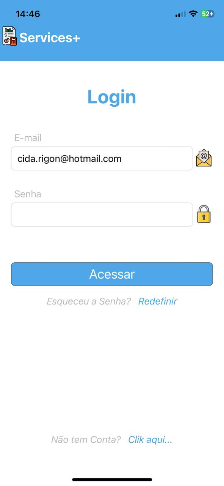
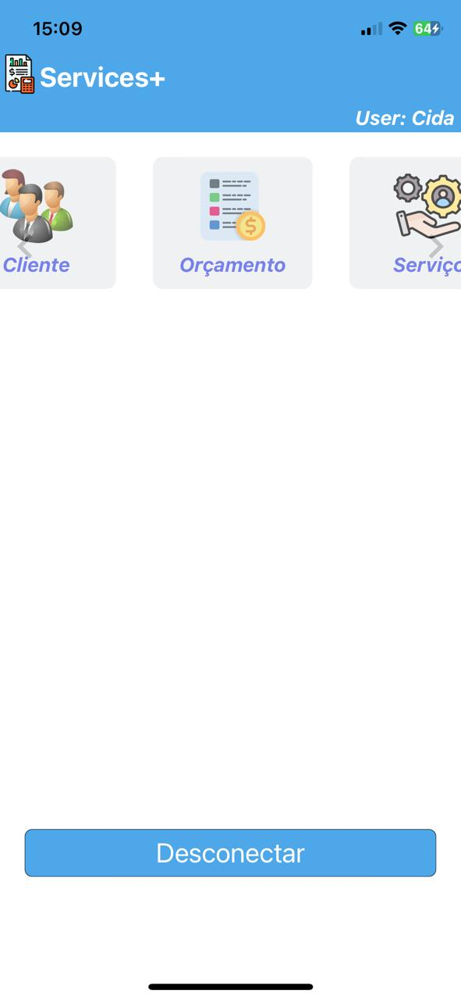

# MyServices+

Esse projeto foi desenvolvido, para mostrar meus conhecimentos em react native...
O objetivo foi criar um app para realizar Orçamentos.

 

## Tabela de Conteúdo

1. Clone o repositório

## Instalação
## Uso
## Funcionalidades
## Licença
